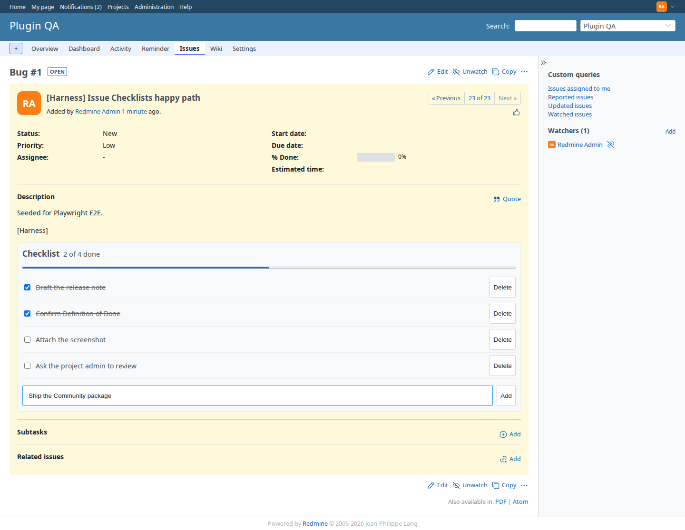

# Redmine Issue Checklists

[](https://redmineshop.com/products/redmine-issue-checklists)
[](LICENSE)
[](https://github.com/redmineshop/redmine_issue_checklists/actions/workflows/ci.yml)

**Last maintained:** 2026-09-25

**Source on GitHub:** [github.com/redmineshop/redmine_issue_checklists](https://github.com/redmineshop/redmine_issue_checklists)

Interactive checklists on Redmine issues — add items, mark them done, and see progress on the issue page. Built for self-hosted teams that want a Definition of Done without turning every step into a subtask.

Community edition is **free forever** — no license key, no phone-home, **no email to clone**.

## Features

- Checklist box on **Issues → show** (below the description)
- Add, toggle done, and delete items (HTML forms; checkbox toggle also works with a small script)
- Progress: `N of M done` plus a meter
- Permission: `manage_issue_checklists` (issue tracking)
- Anyone who can view the issue can see the list; only the permission can change it
- Maximum 50 items per issue
- English + Vietnamese UI strings

## Compatibility

| Redmine | Ruby | Database | Status |
|---------|------|----------|--------|
| 6.x     | 3.2+ | MySQL 8 / PostgreSQL | Targeted — **untested** (no published QA matrix) |
| 5.1.x   | 3.1+ | MySQL 8 / PostgreSQL | Targeted — **untested** |
| 5.0.x   | 3.0+ | MySQL 8 / PostgreSQL | Targeted — **untested** |

The plugin declares `requires_redmine version_or_higher: '5.0'`. Do not treat catalog versions as tested cells.

## Installation

**Estimated time: 5–10 minutes.**

### 1. Clone from GitHub

```bash
cd /path/to/redmine/plugins
git clone https://github.com/redmineshop/redmine_issue_checklists.git
ls redmine_issue_checklists/init.rb
```

Do not rename the plugin directory. If you download a GitHub ZIP, rename the unpacked `redmine_issue_checklists-main` folder to `redmine_issue_checklists`.

### 2. Migrate and restart

This plugin adds table `issue_checklists`:

```bash
cd /path/to/redmine
RAILS_ENV=production bundle exec rake redmine:plugins:migrate NAME=redmine_issue_checklists
# then restart Redmine (systemd, Puma, or docker compose restart)
```

Docker:

```bash
docker exec -e RAILS_ENV=production YOUR_REDMINE_CONTAINER \
  bundle exec rake redmine:plugins:migrate NAME=redmine_issue_checklists
docker restart YOUR_REDMINE_CONTAINER
```

No extra gems.

### 3. Grant permission

**Administration → Roles and permissions** — enable **Manage issue checklists** on roles that should add/toggle/delete items.

Open any issue. The checklist box is below the description.

## Screenshot

Issue page on demo Redmine. The checklist sits under the description: four items, two done, with the progress line.


Adding another item (text in the field, not yet saved):



Screenshot refresh lives in the private `redmineshop/redmineshop` harness. A public clone cannot run it.

## Uninstall

```bash
cd /path/to/redmine
RAILS_ENV=production bundle exec rake redmine:plugins:migrate NAME=redmine_issue_checklists VERSION=0
```

Remove `plugins/redmine_issue_checklists` and restart Redmine. Rolling back the migration **deletes all checklist rows**.

## Tests

Unit + functional (beyond `ruby -c`):

```bash
bundle exec rake redmine:plugins:test NAME=redmine_issue_checklists RAILS_ENV=test
```

On the private `redmineshop/redmineshop` demo stack (not this public clone):

```bash
PLUGIN_NAME=redmine_issue_checklists ./demo/scripts/run-sso-plugin-tests.sh
```

Public CI (`.github/workflows/ci.yml`) is still Ruby syntax only (`ruby -c`). A green badge does not run the MiniTest suite and is not a Redmine compatibility result.

### Quality harness (demo + E2E)

E2E lives in the **private** `redmineshop/redmineshop` harness (`docker-compose.demo.yml` + Playwright). This public GitHub repo is the plugin only — it does not ship that compose file, and a public clone cannot open private harness docs.

Install and smoke this plugin on your own Redmine: [issue checklists product page](https://redmineshop.com/products/redmine-issue-checklists).

| Bar | Status |
| --- | --- |
| Automated tests beyond `ruby -c` | **Verified** — `test/unit` + `test/functional` in this repo |
| Installed + enabled on demo Redmine | **Verified** — mounted via `demo/plugins/` on the private monorepo demo stack; seed enables the module on `plugin-qa` |
| E2E primary happy path | **Verified** — Playwright on that private harness (add item, toggle done) |
| UI screenshot in README | **Verified** — `screenshots/{issue-checklist,checklist-edit}.png` from that spec (full issue page). `issue-page-checklist.png` is the same image as `issue-checklist.png`. There is no per-tracker checklist screen. |
| Redmine 5.1 / 6.x matrix | **Declared / untested** — MiniTest and the Playwright happy path for this pass ran on one demo image (Redmine 7.0.1, Ruby 4.0.7, MySQL 8). That is not a 5.x or 6.x cell, and PostgreSQL was not run |

## Community support

Async only: [GitHub issues](https://github.com/redmineshop/redmine_issue_checklists/issues) or the [support form](https://redmineshop.com/support). No 24/7 SLA.

## License

MIT — see `LICENSE`.
