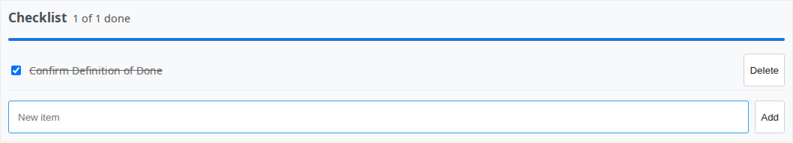

# Redmine Issue Checklists

[](https://redmineshop.com/products/redmine-issue-checklists)
[](LICENSE)
[](https://github.com/redmineshop/redmine_issue_checklists/actions/workflows/ci.yml)

**Last maintained:** 2026-09-22

**Source on GitHub:** [github.com/redmineshop/redmine_issue_checklists](https://github.com/redmineshop/redmine_issue_checklists)

Interactive checklists on Redmine issues.

Add items, mark them done, and see progress on the issue page. Built for self-hosted teams that want a Definition of Done without turning every step into a subtask.

Community edition is free — no license key and no phone-home. Clone from this repository.

## Features

- Checklist box on **Issues → show** (below the description)
- Add, toggle done, and delete items (HTML forms; checkbox toggle also works with a small script)
- Progress: `N of M done` plus a meter
- Permission: `manage_issue_checklists` (issue tracking)
- Anyone who can view the issue can see the list; only the permission can change it
- Maximum 50 items per issue
- English + Vietnamese UI strings

## Compatibility

Declared follows `requires_redmine version_or_higher: '5.0'` for 5.x and 6.x. Redmine 7.0 is not a claimed target. Tested means a run pinned to that Redmine line. The demo image is official `redmine:latest` (tag not pinned), so a demo boot is not a pass for a specific row.

| Redmine | Declared | Tested |
|---------|----------|--------|
| 5.0.x   | Yes      | No — unverified |
| 5.1.x   | Yes      | No — unverified |
| 6.0.x   | Yes      | No — unverified |
| 6.1.x   | Yes      | No — unverified |
| 7.0.x   | No       | No — unverified |

## Installation

**Estimated time: 5–10 minutes.**

### 1. Clone from GitHub

```bash
cd /path/to/redmine/plugins
git clone https://github.com/redmineshop/redmine_issue_checklists.git
ls redmine_issue_checklists/init.rb
```

Do not rename the plugin directory. If you download a GitHub ZIP, rename the unpacked `redmine_issue_checklists-main` folder to `redmine_issue_checklists`.

### 2. Migrate and restart

This plugin adds table `issue_checklists`:

```bash
cd /path/to/redmine
RAILS_ENV=production bundle exec rake redmine:plugins:migrate NAME=redmine_issue_checklists
# then restart Redmine (systemd, Puma, or docker compose restart)
```

Docker:

```bash
docker exec -e RAILS_ENV=production YOUR_REDMINE_CONTAINER \
  bundle exec rake redmine:plugins:migrate NAME=redmine_issue_checklists
docker restart YOUR_REDMINE_CONTAINER
```

No extra gems.

### 3. Grant permission

**Administration → Roles and permissions** — enable **Manage issue checklists** on roles that should add/toggle/delete items.

Open **Administration → Plugins** and confirm **Redmine Issue Checklists** is listed. Then open any issue. The checklist box is below the description.

## Screenshot

Checklist box on the issue page (demo Redmine):



The image is a crop of the checklist box from a demo Redmine. The Redmine version in the capture was not recorded. A full issue-page screenshot is still TODO.

## Uninstall

```bash
cd /path/to/redmine
RAILS_ENV=production bundle exec rake redmine:plugins:migrate NAME=redmine_issue_checklists VERSION=0
```

Remove `plugins/redmine_issue_checklists` and restart Redmine. Rolling back the migration **deletes all checklist rows**.

## Tests

Unit + functional (beyond `ruby -c`):

```bash
bundle exec rake redmine:plugins:test NAME=redmine_issue_checklists RAILS_ENV=test
```

Public GitHub Actions (`.github/workflows/ci.yml`) runs Ruby syntax checks only (`ruby -c`).

## Limits

- At most 50 items per issue. Checklist rows are not subtasks and do not block issue status by themselves.
- Anyone who can view the issue can see the list. Only **Manage issue checklists** can add, toggle, or delete items.
- Uninstall with `VERSION=0` deletes every checklist row.
- MiniTest does not boot Redmine 5.0, 5.1, 6.0, 6.1, or 7.0.
- Product page: https://redmineshop.com/products/redmine-issue-checklists

## Community support

Async only: [GitHub issues](https://github.com/redmineshop/redmine_issue_checklists/issues) or the [support form](https://redmineshop.com/support). No 24/7 SLA.

## License

MIT — see `LICENSE`.
