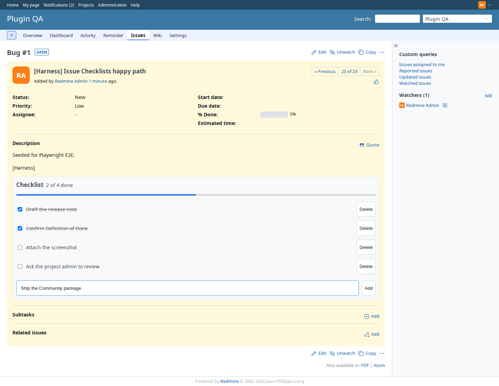

# Redmine Issue Checklists

[](https://redmineshop.com/products/redmine-issue-checklists)
[](LICENSE)
[](https://github.com/redmineshop/redmine_issue_checklists/actions/workflows/ci.yml)

**Last maintained:** 2026-10-04

**Source on GitHub:** [github.com/redmineshop/redmine_issue_checklists](https://github.com/redmineshop/redmine_issue_checklists)

Interactive checklists on Redmine issues — add items, mark them done, and see progress on the issue page. Built for self-hosted teams that want a Definition of Done without turning every step into a subtask.

Community edition is **free forever** — no license key, no phone-home, **no email to clone**.

## Features

- Checklist box on **Issues → show** (below the description)
- Add, toggle done, delete, and move items up or down (HTML forms; the checkbox also submits with a small script)
- Progress: `N of M done` plus a meter
- Permission: `manage_issue_checklists` (issue tracking)
- Anyone who can view the issue can see the list; only that permission can change it
- Copying an issue copies its checklist items when you can see the source issue and you can manage checklists on the destination project. Done state and order are kept. At most 50 items
- Maximum 50 items per issue
- English + Vietnamese UI strings

Checklist edits are not added to the issue history. There is no JSON API and no drag-and-drop reorder.

## Compatibility

| Redmine | Ruby | Database | Status |
|---------|------|----------|--------|
| 7.0.1   | 4.0.7 | SQLite in CI | **Verified** — plugin migration and MiniTest via `test/run-redmine-7.0.1.sh` on the official `redmine:7.0.1` image (Rails 8.1.3.1). GitHub Actions runs that script |
| Other 7.x | — | — | Declared by `requires_redmine version_or_higher: '5.0'`. Not run |
| 6.x     | 3.2+ | MySQL 8 / PostgreSQL | Declared — **not run** |
| 5.1.x   | 3.1+ | MySQL 8 / PostgreSQL | Declared — **not run** |
| 5.0.x   | 3.0+ | MySQL 8 / PostgreSQL | Declared — **not run** |

MySQL 8 and PostgreSQL were not part of the CI run. The plugin declares `requires_redmine version_or_higher: '5.0'`. Only the 7.0.1 / SQLite cell is verified.

## Installation

**Estimated time: 5–10 minutes.**

### 1. Clone from GitHub

```bash
cd /path/to/redmine/plugins
git clone https://github.com/redmineshop/redmine_issue_checklists.git
ls redmine_issue_checklists/init.rb
```

Do not rename the plugin directory. If you download a GitHub ZIP, rename the unpacked `redmine_issue_checklists-main` folder to `redmine_issue_checklists`.

### 2. Migrate and restart

This plugin adds table `issue_checklists`:

```bash
cd /path/to/redmine
RAILS_ENV=production bundle exec rake redmine:plugins:migrate NAME=redmine_issue_checklists
# then restart Redmine (systemd, Puma, or docker compose restart)
```

Docker:

```bash
docker exec -e RAILS_ENV=production YOUR_REDMINE_CONTAINER \
  bundle exec rake redmine:plugins:migrate NAME=redmine_issue_checklists
docker restart YOUR_REDMINE_CONTAINER
```

No extra gems.

### 3. Grant permission

**Administration → Roles and permissions** — enable **Manage issue checklists** on roles that should add, toggle, reorder, or delete items.

Open any issue. The checklist box is below the description.

## Screenshot

Issue page on demo Redmine. The checklist sits under the description: four items, two done, with the progress line.


Adding another item (text in the field, not yet saved):



These screenshots were not retaken when move up / move down was added, so those buttons are not in the pictures.

## Uninstall

```bash
cd /path/to/redmine
RAILS_ENV=production bundle exec rake redmine:plugins:migrate NAME=redmine_issue_checklists VERSION=0
```

Remove `plugins/redmine_issue_checklists` and restart Redmine. Rolling back the migration **deletes all checklist rows**.

## Tests

From a Redmine application that has this plugin under `plugins/`:

```bash
cd /path/to/redmine
RAILS_ENV=test bundle exec rake redmine:plugins:migrate NAME=redmine_issue_checklists
RAILS_ENV=test bundle exec rake redmine:plugins:test NAME=redmine_issue_checklists
```

The official `redmine:7.0.1` image omits the Gemfile `:test` group. `test/run-redmine-7.0.1.sh` installs that group and runs the suite on SQLite. GitHub Actions runs that script (`.github/workflows/ci.yml`). A `ruby -c` job also runs; it is not the compatibility result.

On 2026-10-04, `test/run-redmine-7.0.1.sh` passed on the official `redmine:7.0.1` image (SQLite, Ruby 4.0.7, Rails 8.1.3.1):

```text
67 runs, 283 assertions, 0 failures, 0 errors, 0 skips
```

The suite covers create, toggle, reorder, and delete; view versus manage; non-members; private issues and private projects; a disabled Issue tracking module; mass assignment of `is_done`, `position`, and `issue_id`; SQL metacharacters stored as text; HTML escaped on the issue page and in the flash; missing CSRF tokens; issue copy when the destination allows manage and when it does not; and copy from an issue the user cannot see. GET is not routed to the mutating actions. A JSON request does not create an item. Checklist edits are not written to the issue journal.

| Bar | Status |
| --- | --- |
| Plugin MiniTest on Redmine 7.0.1 | **Verified** — official image, SQLite, Ruby 4.0.7, Rails 8.1.3.1, 67 runs, 283 assertions, 0 failures |
| Redmine 5.x, 6.x, and other 7.x | **Declared** — `requires_redmine version_or_higher: '5.0'`. Not run |
| MySQL 8 / PostgreSQL | **Not run** |
| README screenshots | **Present** — `screenshots/issue-checklist.png` and `screenshots/checklist-edit.png`. Not retaken for the move buttons. `issue-page-checklist.png` is the same image as `issue-checklist.png` |
| Live demo install | **Not done** |
| Browser end-to-end tests | **Not in this repository** |

## Community support

Async only: [GitHub issues](https://github.com/redmineshop/redmine_issue_checklists/issues) or the [support form](https://redmineshop.com/support). No 24/7 SLA.

## License

MIT — see `LICENSE`.
